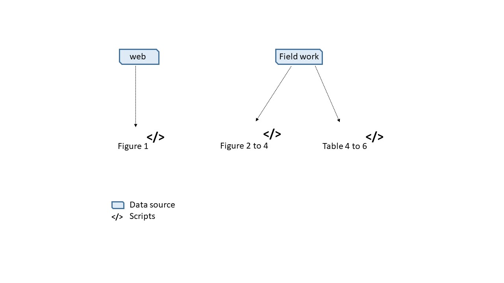

# tropituna_adaptation

## Description

This repository allows to replicate results from the article *Adaptation to climate change in industrial fisheries: evidence from the Basque tropical tuna system*. The scripts in Figure 1 produce figures from the manuscript. The 'data' folder contains the 'non-public' data used to run the scripts.

**Figure 1. Scripts workflow.** Arrows indicate where the necessary data to run scripts come from.
